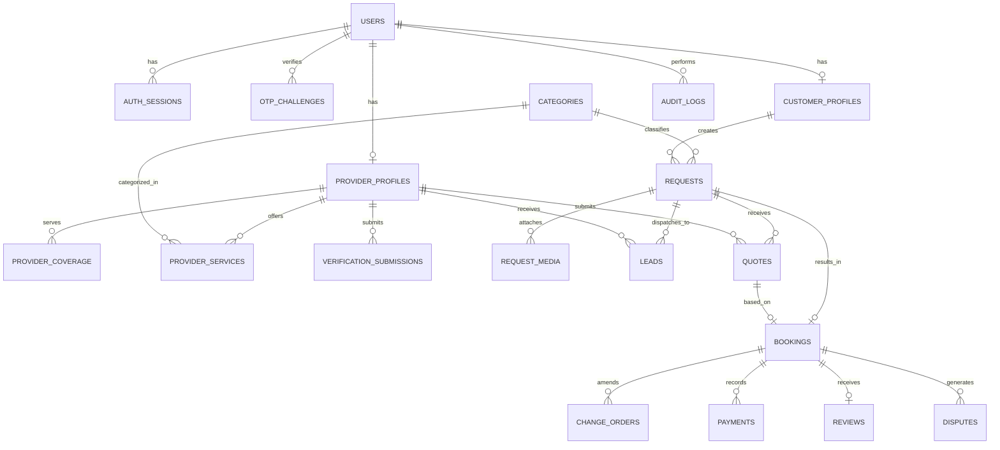

# KaamSaathi — Physical Data Model & Data Dictionary

- **Document Version**: `1.0.0-frozen`
- **Database Engine**: PostgreSQL 16+ with PostGIS 3.4+
- **Status**: `FROZEN`

---

## 1. Entity-Relationship Overview



---

## 2. Table Definitions & Schemas

### 2.1 Identity & Session Domain

#### `users`
Core identity table mapping mobile numbers to system accounts.
```sql
CREATE TABLE users (
    id UUID PRIMARY KEY DEFAULT gen_random_uuid(),
    phone_hmac VARCHAR(64) NOT NULL UNIQUE,       -- Salted SHA-256 for lookup without plaintext
    phone_encrypted BYTEA NOT NULL,               -- AES-256-GCM encrypted raw E.164 phone
    status VARCHAR(32) NOT NULL DEFAULT 'PENDING_PHONE_VERIFICATION',
    roles VARCHAR(32)[] NOT NULL DEFAULT ARRAY['CUSTOMER'],
    active_role VARCHAR(32) NOT NULL DEFAULT 'CUSTOMER',
    preferred_language VARCHAR(5) NOT NULL DEFAULT 'hi' CHECK (preferred_language IN ('hi', 'en')),
    is_admin BOOLEAN NOT NULL DEFAULT FALSE,
    totp_secret_encrypted BYTEA,                  -- Mandatory for admin accounts
    totp_enabled BOOLEAN NOT NULL DEFAULT FALSE,
    created_at TIMESTAMPTZ NOT NULL DEFAULT NOW(),
    updated_at TIMESTAMPTZ NOT NULL DEFAULT NOW()
);
CREATE INDEX idx_users_status ON users(status);
```

#### `auth_sessions`
Active and historical user authentication sessions.
```sql
CREATE TABLE auth_sessions (
    id UUID PRIMARY KEY DEFAULT gen_random_uuid(),
    user_id UUID NOT NULL REFERENCES users(id) ON DELETE CASCADE,
    refresh_token_hash VARCHAR(64) NOT NULL UNIQUE,
    user_agent VARCHAR(255),
    ip_address INET,
    is_revoked BOOLEAN NOT NULL DEFAULT FALSE,
    revoked_reason VARCHAR(64),
    expires_at TIMESTAMPTZ NOT NULL,
    created_at TIMESTAMPTZ NOT NULL DEFAULT NOW(),
    updated_at TIMESTAMPTZ NOT NULL DEFAULT NOW()
);
CREATE INDEX idx_sessions_user ON auth_sessions(user_id) WHERE is_revoked = FALSE;
```

#### `otp_challenges`
Bounded authentication verification tokens.
```sql
CREATE TABLE otp_challenges (
    id UUID PRIMARY KEY DEFAULT gen_random_uuid(),
    phone_hmac VARCHAR(64) NOT NULL,
    otp_hash VARCHAR(64) NOT NULL,                -- Salted hash of 6-digit code
    attempt_count INTEGER NOT NULL DEFAULT 0,
    max_attempts INTEGER NOT NULL DEFAULT 3,
    is_used BOOLEAN NOT NULL DEFAULT FALSE,
    expires_at TIMESTAMPTZ NOT NULL,
    created_at TIMESTAMPTZ NOT NULL DEFAULT NOW()
);
CREATE INDEX idx_otp_lookup ON otp_challenges(phone_hmac, is_used, expires_at);
```

---

### 2.2 Profiles & Catalogue Domain

#### `customer_profiles`
Customer household preferences and privacy flags.
```sql
CREATE TABLE customer_profiles (
    id UUID PRIMARY KEY DEFAULT gen_random_uuid(),
    user_id UUID NOT NULL UNIQUE REFERENCES users(id) ON DELETE CASCADE,
    full_name VARCHAR(100) NOT NULL,
    district_id VARCHAR(50) NOT NULL,             -- e.g., 'UP_LUCKNOW'
    locality_name VARCHAR(100) NOT NULL,          -- e.g., 'Aliganj'
    pin_code VARCHAR(6) NOT NULL CHECK (pin_code ~ '^[1-9][0-9]{5}$'),
    address_line_encrypted BYTEA,                 -- Revealed only upon booking
    masked_notifications BOOLEAN NOT NULL DEFAULT TRUE,
    created_at TIMESTAMPTZ NOT NULL DEFAULT NOW(),
    updated_at TIMESTAMPTZ NOT NULL DEFAULT NOW()
);
```

#### `provider_profiles`
Local professional profiles, verification status, and reputation.
```sql
CREATE TABLE provider_profiles (
    id UUID PRIMARY KEY DEFAULT gen_random_uuid(),
    user_id UUID NOT NULL UNIQUE REFERENCES users(id) ON DELETE CASCADE,
    business_name VARCHAR(120) NOT NULL,
    trade_title VARCHAR(100) NOT NULL,            -- e.g., 'Bijli Mistri'
    status VARCHAR(32) NOT NULL DEFAULT 'DRAFT',  -- DRAFT, SUBMITTED, IN_REVIEW, APPROVED_ACTIVE, RESTRICTED
    availability_status VARCHAR(20) NOT NULL DEFAULT 'AVAILABLE' CHECK (availability_status IN ('AVAILABLE', 'BUSY', 'OFFLINE')),
    bio TEXT,
    years_experience SMALLINT DEFAULT 0,
    rating_avg NUMERIC(3, 2) NOT NULL DEFAULT 0.00,
    rating_count INTEGER NOT NULL DEFAULT 0,
    completed_jobs_count INTEGER NOT NULL DEFAULT 0,
    badges_summary JSONB NOT NULL DEFAULT '[]'::jsonb, -- Computed trust badges
    created_at TIMESTAMPTZ NOT NULL DEFAULT NOW(),
    updated_at TIMESTAMPTZ NOT NULL DEFAULT NOW()
);
CREATE INDEX idx_provider_status ON provider_profiles(status, availability_status);
```

#### `provider_coverage`
Geospatial operational boundaries within Uttar Pradesh.
```sql
CREATE TABLE provider_coverage (
    id UUID PRIMARY KEY DEFAULT gen_random_uuid(),
    provider_id UUID NOT NULL REFERENCES provider_profiles(id) ON DELETE CASCADE,
    district_id VARCHAR(50) NOT NULL,             -- e.g., 'UP_LUCKNOW'
    location_center GEOMETRY(Point, 4326) NOT NULL,
    radius_meters INTEGER NOT NULL CHECK (radius_meters BETWEEN 1000 AND 50000),
    created_at TIMESTAMPTZ NOT NULL DEFAULT NOW()
);
CREATE INDEX idx_provider_coverage_geo ON provider_coverage USING GIST(location_center);
CREATE INDEX idx_provider_coverage_district ON provider_coverage(district_id);
```

#### `categories`
Marketplace service categories (English + Hindi strings).
```sql
CREATE TABLE categories (
    id VARCHAR(50) PRIMARY KEY,                   -- e.g., 'electrician', 'plumber'
    name_en VARCHAR(100) NOT NULL,
    name_hi VARCHAR(100) NOT NULL,
    icon_name VARCHAR(50) NOT NULL,
    display_order SMALLINT NOT NULL DEFAULT 0,
    is_active BOOLEAN NOT NULL DEFAULT TRUE,
    questions_schema JSONB NOT NULL DEFAULT '[]'::jsonb,
    created_at TIMESTAMPTZ NOT NULL DEFAULT NOW()
);
```

#### `provider_services`
Services and standard rate cards configured by providers.
```sql
CREATE TABLE provider_services (
    id UUID PRIMARY KEY DEFAULT gen_random_uuid(),
    provider_id UUID NOT NULL REFERENCES provider_profiles(id) ON DELETE CASCADE,
    category_id VARCHAR(50) NOT NULL REFERENCES categories(id) ON DELETE RESTRICT,
    visitation_fee_paise INTEGER NOT NULL DEFAULT 0,
    pricing_notes TEXT,
    created_at TIMESTAMPTZ NOT NULL DEFAULT NOW(),
    UNIQUE (provider_id, category_id)
);
```

#### `verification_submissions`
Voluntary identity and trade evidence.
```sql
CREATE TABLE verification_submissions (
    id UUID PRIMARY KEY DEFAULT gen_random_uuid(),
    provider_id UUID NOT NULL REFERENCES provider_profiles(id) ON DELETE CASCADE,
    document_type VARCHAR(50) NOT NULL,           -- 'GOVT_PHOTO_ID', 'TRADE_CERT', 'PEER_REFERENCE'
    storage_path VARCHAR(255) NOT NULL,           -- Non-public object storage key
    status VARCHAR(32) NOT NULL DEFAULT 'IN_REVIEW', -- IN_REVIEW, APPROVED, REJECTED
    reviewer_id UUID REFERENCES users(id),
    review_notes TEXT,
    badge_granted VARCHAR(50),                    -- Specific badge granted e.g. 'ID_VERIFIED'
    reviewed_at TIMESTAMPTZ,
    created_at TIMESTAMPTZ NOT NULL DEFAULT NOW()
);
CREATE INDEX idx_verification_queue ON verification_submissions(status, created_at);
```

---

### 2.3 Marketplace Request & Booking Domain

#### `requests`
Customer repair and service requests.
```sql
CREATE TABLE requests (
    id UUID PRIMARY KEY DEFAULT gen_random_uuid(),
    customer_id UUID NOT NULL REFERENCES customer_profiles(id) ON DELETE RESTRICT,
    category_id VARCHAR(50) NOT NULL REFERENCES categories(id) ON DELETE RESTRICT,
    request_type VARCHAR(20) NOT NULL CHECK (request_type IN ('TARGETED', 'BROADCAST')),
    target_provider_id UUID REFERENCES provider_profiles(id),
    status VARCHAR(32) NOT NULL DEFAULT 'DRAFT',
    district_id VARCHAR(50) NOT NULL,
    locality_name VARCHAR(100) NOT NULL,
    pin_code VARCHAR(6) NOT NULL,
    location_point GEOMETRY(Point, 4326),
    description TEXT NOT NULL,
    preferred_schedule_window VARCHAR(50),
    version INTEGER NOT NULL DEFAULT 1,
    created_at TIMESTAMPTZ NOT NULL DEFAULT NOW(),
    updated_at TIMESTAMPTZ NOT NULL DEFAULT NOW()
);
CREATE INDEX idx_requests_status ON requests(status, district_id);
```

#### `leads`
Controlled lead distribution to candidate providers.
```sql
CREATE TABLE leads (
    id UUID PRIMARY KEY DEFAULT gen_random_uuid(),
    request_id UUID NOT NULL REFERENCES requests(id) ON DELETE CASCADE,
    provider_id UUID NOT NULL REFERENCES provider_profiles(id) ON DELETE CASCADE,
    status VARCHAR(20) NOT NULL DEFAULT 'DISPATCHED' CHECK (status IN ('DISPATCHED', 'VIEWED', 'DECLINED', 'QUOTED', 'EXPIRED')),
    decline_reason VARCHAR(100),
    expires_at TIMESTAMPTZ NOT NULL,
    created_at TIMESTAMPTZ NOT NULL DEFAULT NOW(),
    updated_at TIMESTAMPTZ NOT NULL DEFAULT NOW(),
    UNIQUE (request_id, provider_id)
);
CREATE INDEX idx_leads_provider ON leads(provider_id, status);
```

#### `quotes`
Itemized pricing estimates dispatched by providers.
```sql
CREATE TABLE quotes (
    id UUID PRIMARY KEY DEFAULT gen_random_uuid(),
    request_id UUID NOT NULL REFERENCES requests(id) ON DELETE CASCADE,
    provider_id UUID NOT NULL REFERENCES provider_profiles(id) ON DELETE CASCADE,
    status VARCHAR(20) NOT NULL DEFAULT 'DRAFT' CHECK (status IN ('DRAFT', 'DISPATCHED', 'VIEWED', 'ACCEPTED', 'DECLINED', 'EXPIRED')),
    itemized_charges JSONB NOT NULL,              -- Array of { description, amount_paise }
    total_amount_paise INTEGER NOT NULL CHECK (total_amount_paise > 0),
    visitation_fee_paise INTEGER NOT NULL DEFAULT 0,
    estimated_duration_minutes INTEGER,
    terms_and_conditions TEXT,
    expires_at TIMESTAMPTZ NOT NULL,
    created_at TIMESTAMPTZ NOT NULL DEFAULT NOW(),
    updated_at TIMESTAMPTZ NOT NULL DEFAULT NOW()
);
CREATE INDEX idx_quotes_request ON quotes(request_id, status);
```

#### `bookings`
The binding work order created upon quote acceptance.
```sql
CREATE TABLE bookings (
    id UUID PRIMARY KEY DEFAULT gen_random_uuid(),
    booking_number VARCHAR(20) NOT NULL UNIQUE,   -- Human-readable e.g. 'KS-UP-26-000123'
    request_id UUID NOT NULL UNIQUE REFERENCES requests(id) ON DELETE RESTRICT,
    quote_id UUID NOT NULL UNIQUE REFERENCES quotes(id) ON DELETE RESTRICT,
    customer_id UUID NOT NULL REFERENCES customer_profiles(id) ON DELETE RESTRICT,
    provider_id UUID NOT NULL REFERENCES provider_profiles(id) ON DELETE RESTRICT,
    status VARCHAR(32) NOT NULL DEFAULT 'CONFIRMED', -- CONFIRMED, EN_ROUTE, ARRIVED, IN_PROGRESS, COMPLETED, CANCELLED, DISPUTED
    service_address_full TEXT NOT NULL,           -- Exact address revealed to accepted provider
    contact_phone_customer VARCHAR(15) NOT NULL,
    contact_phone_provider VARCHAR(15) NOT NULL,
    agreed_quote_total_paise INTEGER NOT NULL,
    final_payable_paise INTEGER NOT NULL,         -- Quote total + approved change orders
    started_at TIMESTAMPTZ,
    completed_at TIMESTAMPTZ,
    cancellation_reason VARCHAR(100),
    cancelled_by_role VARCHAR(20),
    version INTEGER NOT NULL DEFAULT 1,
    created_at TIMESTAMPTZ NOT NULL DEFAULT NOW(),
    updated_at TIMESTAMPTZ NOT NULL DEFAULT NOW(),
    CONSTRAINT chk_self_dealing_booking CHECK (customer_id != provider_id)
);
CREATE INDEX idx_bookings_actors ON bookings(customer_id, provider_id, status);
```

#### `change_orders`
On-site scope adjustments requiring customer approval.
```sql
CREATE TABLE change_orders (
    id UUID PRIMARY KEY DEFAULT gen_random_uuid(),
    booking_id UUID NOT NULL REFERENCES bookings(id) ON DELETE CASCADE,
    provider_id UUID NOT NULL REFERENCES provider_profiles(id) ON DELETE RESTRICT,
    status VARCHAR(20) NOT NULL DEFAULT 'PENDING' CHECK (status IN ('PENDING', 'APPROVED', 'REJECTED')),
    delta_amount_paise INTEGER NOT NULL,          -- Can be positive or negative
    reason TEXT NOT NULL,
    itemized_details JSONB NOT NULL DEFAULT '[]'::jsonb,
    customer_action_at TIMESTAMPTZ,
    created_at TIMESTAMPTZ NOT NULL DEFAULT NOW()
);
CREATE INDEX idx_change_orders_booking ON change_orders(booking_id, status);
```

---

### 2.4 Payments, Reviews & Support Domain

#### `payments`
Immutable payment declarations and verification records.
```sql
CREATE TABLE payments (
    id UUID PRIMARY KEY DEFAULT gen_random_uuid(),
    booking_id UUID NOT NULL REFERENCES bookings(id) ON DELETE RESTRICT,
    payer_id UUID NOT NULL REFERENCES users(id) ON DELETE RESTRICT,
    payee_id UUID NOT NULL REFERENCES users(id) ON DELETE RESTRICT,
    amount_paise INTEGER NOT NULL CHECK (amount_paise > 0),
    payment_method VARCHAR(20) NOT NULL CHECK (payment_method IN ('CASH', 'UPI_EXTERNAL_INTENT', 'PSP_DIRECT')),
    status VARCHAR(32) NOT NULL DEFAULT 'DECLARED', -- DECLARED, CONFIRMED_BY_PROVIDER, RECONCILED_PSP, FAILED, DISPUTED
    upi_transaction_ref VARCHAR(100),
    cash_receipt_reference VARCHAR(50),
    psp_callback_payload JSONB,
    created_at TIMESTAMPTZ NOT NULL DEFAULT NOW(),
    updated_at TIMESTAMPTZ NOT NULL DEFAULT NOW()
);
CREATE INDEX idx_payments_booking ON payments(booking_id);
```

#### `reviews`
Verified customer reviews of completed bookings.
```sql
CREATE TABLE reviews (
    id UUID PRIMARY KEY DEFAULT gen_random_uuid(),
    booking_id UUID NOT NULL UNIQUE REFERENCES bookings(id) ON DELETE RESTRICT,
    customer_id UUID NOT NULL REFERENCES customer_profiles(id) ON DELETE RESTRICT,
    provider_id UUID NOT NULL REFERENCES provider_profiles(id) ON DELETE RESTRICT,
    rating SMALLINT NOT NULL CHECK (rating BETWEEN 1 AND 5),
    comment TEXT,
    status VARCHAR(20) NOT NULL DEFAULT 'PUBLISHED' CHECK (status IN ('PUBLISHED', 'FLAGGED_IN_REVIEW', 'HIDDEN')),
    provider_response TEXT,
    provider_responded_at TIMESTAMPTZ,
    created_at TIMESTAMPTZ NOT NULL DEFAULT NOW(),
    updated_at TIMESTAMPTZ NOT NULL DEFAULT NOW()
);
CREATE INDEX idx_reviews_provider ON reviews(provider_id, status);
```

#### `disputes`
Disputes, safety escalations, and grievance cases.
```sql
CREATE TABLE disputes (
    id UUID PRIMARY KEY DEFAULT gen_random_uuid(),
    dispute_number VARCHAR(20) NOT NULL UNIQUE,   -- e.g. 'DSP-26-00045'
    booking_id UUID NOT NULL REFERENCES bookings(id) ON DELETE RESTRICT,
    opened_by_user_id UUID NOT NULL REFERENCES users(id) ON DELETE RESTRICT,
    category VARCHAR(50) NOT NULL,                -- 'PAYMENT_MISMATCH', 'NO_SHOW', 'POOR_QUALITY', 'SAFETY_URGENT'
    severity VARCHAR(20) NOT NULL DEFAULT 'NORMAL' CHECK (severity IN ('LOW', 'NORMAL', 'HIGH', 'CRITICAL_SAFETY')),
    status VARCHAR(32) NOT NULL DEFAULT 'OPEN',   -- OPEN, UNDER_INVESTIGATION, RESOLVED, APPEALED, CLOSED
    assigned_agent_id UUID REFERENCES users(id),
    resolution_summary TEXT,
    resolution_action VARCHAR(50),
    created_at TIMESTAMPTZ NOT NULL DEFAULT NOW(),
    updated_at TIMESTAMPTZ NOT NULL DEFAULT NOW()
);
CREATE INDEX idx_disputes_status ON disputes(status, severity);
```

#### `audit_logs`
Append-only immutable audit trail for governance, safety, and compliance.
```sql
CREATE TABLE audit_logs (
    id BIGSERIAL PRIMARY KEY,
    entity_name VARCHAR(50) NOT NULL,
    entity_id VARCHAR(50) NOT NULL,
    actor_id UUID,
    actor_role VARCHAR(32) NOT NULL,
    action VARCHAR(100) NOT NULL,                 -- e.g., 'QUOTE_ACCEPTED', 'PHONE_REVEALED', 'ADMIN_MFA_LOGIN'
    previous_state VARCHAR(50),
    new_state VARCHAR(50),
    metadata JSONB NOT NULL DEFAULT '{}'::jsonb,  -- Excludes PII and secret values
    ip_address INET,
    correlation_id VARCHAR(64) NOT NULL,
    created_at TIMESTAMPTZ NOT NULL DEFAULT NOW()
);
CREATE INDEX idx_audit_lookup ON audit_logs(entity_name, entity_id, created_at);
CREATE INDEX idx_audit_actor ON audit_logs(actor_id, created_at);
```

---

## 3. PII & Data Classification Register

| Table | Column | Sensitivity Tier | Masking Rule | Retention Policy |
|---|---|---|---|---|
| `users` | `phone_encrypted` | **Tier 1: Restricted** | AES-256-GCM; never in logs | Retained until deletion |
| `users` | `phone_hmac` | Tier 2: Pseudonymous | Keyed hash; query only | Anonymized on purge |
| `customer_profiles` | `address_line_encrypted` | **Tier 1: Restricted** | Revealed only to booked provider | Purged 7 days post-job |
| `customer_profiles` | `full_name` | Tier 2: Protected | Display name in UI; masked in support | Retained with account |
| `verification_submissions` | `storage_path` | **Tier 1: Restricted** | Private presigned URL only | Retained 3 years post-audit |
| `bookings` | `service_address_full` | **Tier 1: Restricted** | Masked in all external logs | Masked post-completion |
| `payments` | `upi_transaction_ref` | Tier 2: Protected | Last 4 digits visible only | Retained 7 years (Tax/RBI) |
| `audit_logs` | `metadata` | Tier 3: Internal | Automated PII scanner verifies no raw tokens | Retained 7 years |
