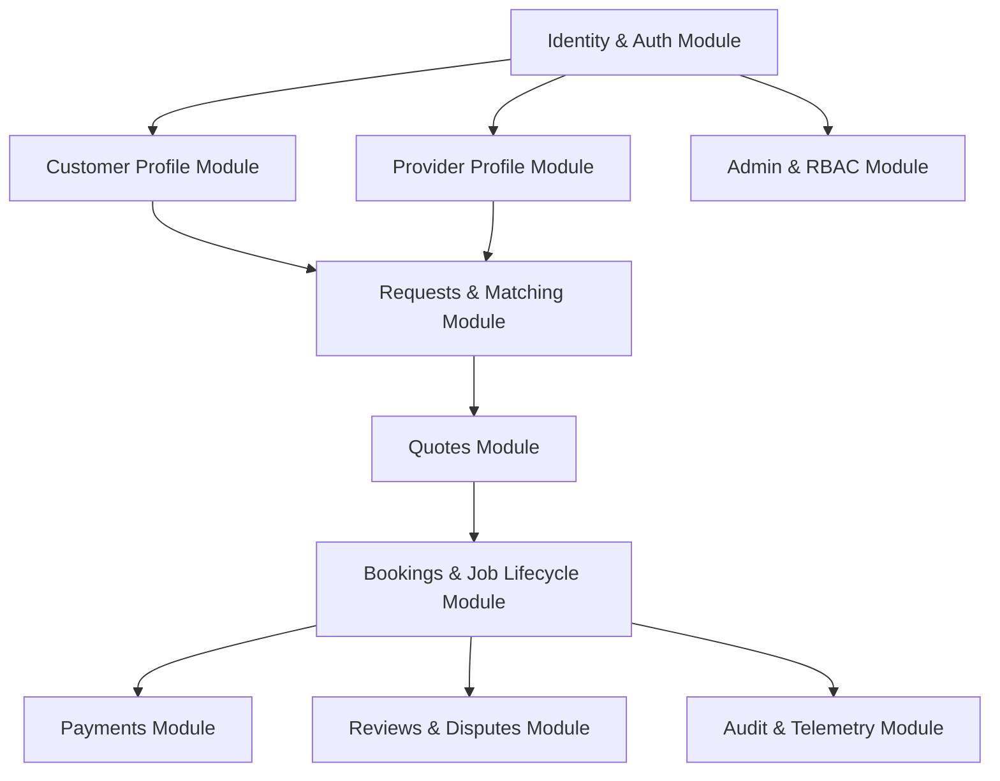

# ADR-001: Monorepo Architecture & Domain Module Boundaries

- **Status**: `ACCEPTED` (Approved by Principal Architect & Product Lead)
- **Date**: `2026-09-13`
- **Deciders**: Umesh Kumar (Project Owner), Principal Architect, Backend Lead, Android Lead

---

## 1. Context & Problem Statement

KaamSaathi is an Android-first hyperlocal marketplace requiring synchronized development across:
1. Role-aware Android mobile client (Customer + Provider modes) in Kotlin / Jetpack Compose.
2. Responsive public web application (Vite / React / SSR) in TypeScript.
3. Secure administrative operations portal (RBAC + MFA) in TypeScript.
4. Versioned backend REST API in TypeScript / NestJS.
5. Shared packages: API contracts/DTOs, design tokens, and Hindi/English localization tables.

We need a repository and architecture structure that:
- Prevents contract drift between clients and server.
- Supports independent builds, deployments, and testing.
- Allows parallel Antigravity agent worktrees without file conflicts.
- Avoids premature distributed microservices overhead while maintaining strict modular domain boundaries.

---

## 2. Decision

We adopt a **pnpm-driven Monorepo with a Modular Monolith Backend**:

### 2.1 Monorepo Layout
```text
KaamSaathi/
├── apps/
│   ├── android/             # Kotlin + Jetpack Compose (Gradle multi-module)
│   ├── web/                 # Public website (Vite / SSR / TypeScript)
│   └── admin/               # Internal Admin Portal (React / TypeScript)
├── services/
│   └── api/                 # Modular Monolith Backend (NestJS / TypeScript)
├── packages/
│   ├── contracts/           # Generated OpenAPI DTOs, schemas, and validators
│   ├── design-tokens/       # Color palette, spacing, typography, a11y tokens
│   ├── localization/        # Hindi (hi) & English (en) string dictionaries
│   └── shared-config/       # Shared environment & validation configs
├── docs/                    # Architecture, specifications, ADRs, runbooks
└── .agents/                 # Antigravity agents, rules, and skills
```

### 2.2 Backend Domain Modules & Dependency Direction
The backend (`services/api`) is structured as a strict Modular Monolith. Circular dependencies between modules are forbidden.



### 2.3 Module Responsibility Invariants
1. **Identity**: Owns user accounts, phone normalization, OTP challenge/verification, JWT session issuance, refresh tokens, and revocation. Does *not* make business decisions regarding provider eligibility.
2. **Customer / Provider Profiles**: Owns user preferences, profiles, coverage preferences, and skills. Provider role activation does not imply marketplace eligibility.
3. **Verification**: Owns verification cases, document evidence metadata, and trust badge computation. Public profile rendering queries computed badge summaries, never raw evidence.
4. **Catalogue & Location**: Owns category trees, UP district definitions, and PostGIS spatial indexing.
5. **Requests & Matching**: Owns customer request lifecycle and radius-based provider lead dispatch.
6. **Quotes & Bookings**: Owns quote versions, atomic acceptance, job state machine, and change orders.
7. **Payments**: Owns payment references, provider cash receipt logging, and PSP webhook callbacks. Never stores card details or UPI PINs.
8. **Audit & Safety**: Owns immutable audit log insertion and security escalation workflows.

---

## 3. Consequences

### Positive
- **Single Source of Truth**: Shared contracts (`packages/contracts`) and localization strings (`packages/localization`) are consumed across backend and web directly.
- **Contract Fidelity**: Mobile models can be generated directly from the frozen OpenAPI specification.
- **Low Operational Overhead**: Single backend deployable unit; no service-mesh, distributed tracing, or multi-repo synchronization friction.
- **Strict Concurrency Safety**: In-process database transactions manage critical marketplace invariants (such as single quote acceptance).

### Negative / Trade-offs
- Monorepo tooling setup requires disciplined CI caching and task orchestration via pnpm.
- Android project utilizes Gradle, which lives alongside the pnpm workspace; shared contracts must be exported as JSON/OpenAPI for Gradle code-generation plugins.
