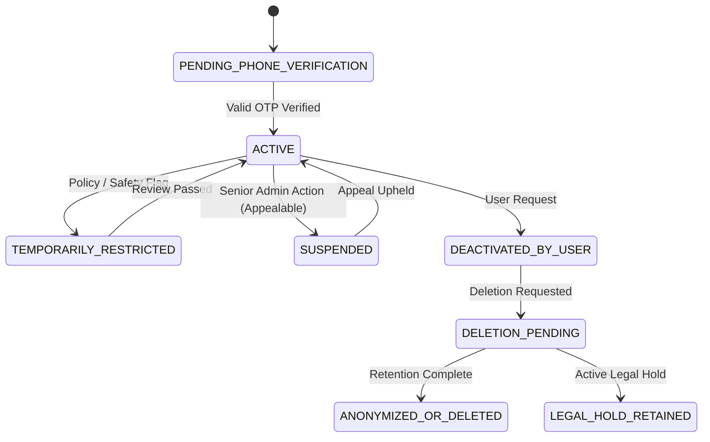
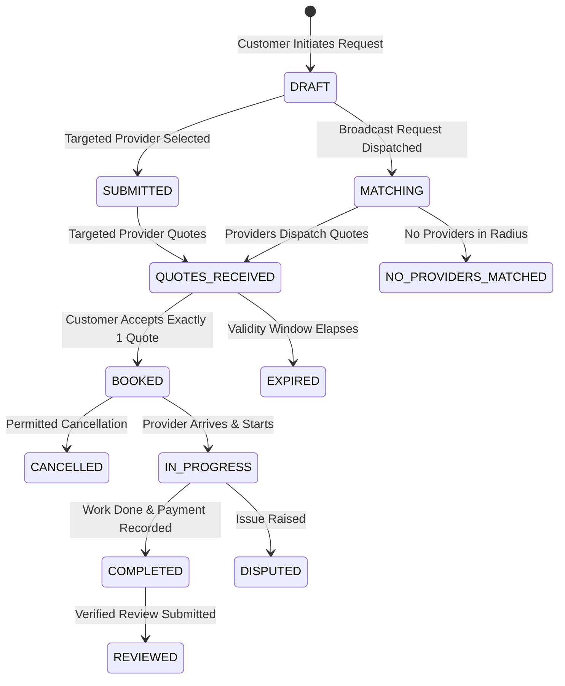

# KaamSaathi — Frozen MVP Functional Baseline (M1)

- **Document Version**: `1.0.0-frozen`
- **Freeze Date**: `2026-09-13`
- **Designated Project Owner**: Umesh Kumar
- **Marketplace Coverage**: Uttar Pradesh (All 75 districts, with initial seed launch clusters)
- **Status**: `PENDING_HUMAN_CHECKPOINT_1_SIGN_OFF`

---

## 1. Executive Baseline & Governance

This document establishes the frozen functional scope for the Minimum Viable Product (MVP) of **KaamSaathi**. Once signed off by the Project Owner (Umesh Kumar), any functional modification, scope expansion, or state-machine change must pass through formal change control in [`docs/project/DECISION_LOG.md`](file:///C:/Users/Umesh%20Kumar/.gemini/antigravity/scratch/KaamSaathi/docs/project/DECISION_LOG.md).

### Source-of-Truth Hierarchy
1. Recorded Owner Approvals ([`docs/project/APPROVALS.md`](file:///C:/Users/Umesh%20Kumar/.gemini/antigravity/scratch/KaamSaathi/docs/project/APPROVALS.md))
2. Applicable Law, Indian DPDP Act 2023, Consumer Protection (E-Commerce) Rules 2020, and Google Play Policies
3. Master Execution Contract ([`KAAMSAATHI_MASTER_EXECUTION_PROMPT.md`](file:///C:/Users/Umesh%20Kumar/.gemini/antigravity/scratch/KaamSaathi/KAAMSAATHI_MASTER_EXECUTION_PROMPT.md))
4. Authoritative State Machines ([`docs/product/STATE_MACHINES.md`](file:///C:/Users/Umesh%20Kumar/.gemini/antigravity/scratch/KaamSaathi/docs/product/STATE_MACHINES.md))
5. Authoritative Business Rules ([`docs/product/BUSINESS_RULES.md`](file:///C:/Users/Umesh%20Kumar/.gemini/antigravity/scratch/KaamSaathi/docs/product/BUSINESS_RULES.md))
6. Functional Workflow Specification ([`docs/product/FUNCTIONAL_WORKFLOW_SPEC.md`](file:///C:/Users/Umesh%20Kumar/.gemini/antigravity/scratch/KaamSaathi/docs/product/FUNCTIONAL_WORKFLOW_SPEC.md))
7. Approved ADRs and API Contracts

---

## 2. Locked Marketplace Scope

### 2.1 Geography
- **Territory**: State of **Uttar Pradesh**, covering all 75 administrative districts.
- **District Hierarchy**: State -> District (e.g. Lucknow, Kanpur Nagar, Varanasi, Agra, Prayagraj) -> Tehsil/Sub-district -> Locality / Pin Code.
- **Pilot Seed Focus**: Initial launch density focused on major urban/semi-urban clusters (e.g., Lucknow & Varanasi clusters) with database schema and APIs ready for all 75 UP districts.

### 2.2 Core Service Categories
1. **Electrician** (wiring repair, fan installation, switchboard repair, MCB/fuse fix, inverter setup).
2. **Plumber** (pipe leak repair, tap replacement, water tank cleaning, bathroom fittings, motor installation).
3. **Appliance Repair** (refrigerator, washing machine, microwave, water purifier, geyser/water heater repair).
*(Note: Extensible schema allows adding carpentry, masonry, painting, etc., via operational configuration without schema changes).*

### 2.3 Marketplace Model
- **Light-managed, community-verified booking marketplace**:
  - Platform controls: Onboarding, verification review, lead matching, state transitions, quote immutability, dispute resolution, and review authenticity.
  - Providers control: Availability, travel radius within UP districts, lead acceptance, job estimates, and execution.
  - **Trust Language Constraint (Locked)**: Verification badges state *exactly* what was checked (e.g., "Phone Verified", "ID Checked", "Trade Reference Confirmed"). The platform explicitly does *not* claim or guarantee worker competence or personal safety.

---

## 3. Product Surfaces & Capabilities

### 3.1 Role-Aware Android App (Kotlin + Jetpack Compose)
- Single APK supporting **Customer Mode** and **Provider Mode** with instantaneous role switching.
- **Strict Role Isolation**: Permissions evaluated per action server-side. A provider in customer mode cannot view provider leads.
- **Self-Dealing Exclusion**: An account is barred from requesting, quoting, or booking work with its own provider profile.
- **Low-Connectivity & Offline Support**: Local draft persistence, retry-safe idempotent network requests, and graceful degradation on 2G/3G networks.
- **Dual-Language & Accessibility**: Full Hindi (`hi`) and English (`en`) support with instant language switching without data loss. Font scaling up to platform maximum; zero icon-only critical controls.

### 3.2 Responsive Public Website (Vite / TypeScript SSR)
- Genuine UP service and district landing pages (no doorway/fake pages).
- Provider registration guidance and transparency disclosures.
- Customer support, trust & safety guidelines, grievance officer contact, privacy policy, and terms of service.

### 3.3 Secure Admin Portal (Vite / React / TypeScript)
- Role-Based Access Control (RBAC): Verification Agent, Support Agent, Trust & Safety Agent, Content Operator, Privileged Admin.
- **Mandatory TOTP MFA** for all administrative accounts.
- Granular queues: Provider verification submissions, dispute resolution, safety escalations, content moderation, and audit log inspection.

### 3.4 Versioned Backend API (Modular Monolith / NestJS / TypeScript)
- PostgreSQL with PostGIS for geospatial indexing and bounded radius searches.
- Structured domain modules with transactional boundaries.
- Server-enforced state machines and idempotency keys on all state-changing endpoints.

---

## 4. Complete Requirement Matrix (Frozen MVP Baseline)

### 4.1 Customer Journeys (C-01 to C-14)
| Req ID | Capability | Trigger / Preconditions | Server State Transition | Data Written | Security / Privacy Gate |
|---|---|---|---|---|---|
| `REQ-C-01` | First launch & language select | App install / first open | None | `user_preferences.language` (hi/en) | No permission gates before language |
| `REQ-C-02` | Mobile OTP login / registration | Phone number entry | `PENDING_PHONE_VERIFICATION` -> `ACTIVE` | `users`, `auth_sessions`, `audit_logs` | Anti-enumeration, rate-limited by IP/device |
| `REQ-C-03` | Customer profile & privacy | Post-OTP onboarding | `ACTIVE` | `customer_profiles` (name, locality) | Shared-phone privacy: masked notifications |
| `REQ-C-04` | Category discovery & problem search | Customer browse | None | `search_logs` (anonymized) | Active UP categories only |
| `REQ-C-05` | Problem description & media | Customer creates request | `requests.DRAFT` | `requests`, `request_media` | Presigned URL upload, EXIF metadata stripped |
| `REQ-C-06` | Location & schedule selection | Customer specifies area | `requests.DRAFT` | `requests.locality_id`, `pin_code` | Locality/PIN precision; exact address hidden |
| `REQ-C-07` | Targeted provider request | Customer picks provider | `requests.DRAFT` -> `SUBMITTED` | `requests`, `leads` (single provider) | Provider eligibility verified server-side |
| `REQ-C-08` | Broadcast matching request | Customer requests quotes | `requests.DRAFT` -> `MATCHING` | `requests`, `leads` (batch up to limit) | Controlled lead batching; bounded radius |
| `REQ-C-09` | Quote review & comparison | Provider quotes received | `quotes.RECEIVED` -> `VIEWED` | `quote_views` | Immutability of dispatched quotes |
| `REQ-C-10` | Quote acceptance & booking | Customer accepts 1 quote | `quotes.ACCEPTED`, `bookings.CONFIRMED` | `bookings`, `audit_logs` | Atomic transaction: exactly 1 booking per req |
| `REQ-C-11` | Job progress tracking | Booking confirmed | `bookings.EN_ROUTE` -> `ARRIVED` -> `IN_PROGRESS` | `job_state_history` | Server-controlled valid transitions only |
| `REQ-C-12` | Completion & payment declaration| Job physically done | `bookings.COMPLETED`, `payments.DECLARED` | `payments` (cash/UPI ref) | Cash/UPI reference recorded; no stored wallet |
| `REQ-C-13` | Verified rating & review | Completed booking | `reviews.SUBMITTED` -> `PUBLISHED` | `reviews` | Validated completed booking required |
| `REQ-C-14` | Support, cancellation & dispute | Issue during booking | `bookings.CANCELLED` / `DISPUTED` | `disputes`, `tickets` | Full audit preservation, emergency disclaimer |

### 4.2 Provider Journeys (P-01 to P-13)
| Req ID | Capability | Trigger / Preconditions | Server State Transition | Data Written | Security / Privacy Gate |
|---|---|---|---|---|---|
| `REQ-P-01` | Provider role activation | Customer switches to provider | `provider_profiles.DRAFT` | `provider_profiles` | Role switch recorded; self-dealing guard |
| `REQ-P-02` | Coverage area & radius | Provider profile setup | `provider_profiles.DRAFT` | `provider_coverage` (UP districts/PINs) | Bounded to verified operating locations |
| `REQ-P-03` | Pricing & standard estimates | Provider rate card setup | `provider_profiles.DRAFT` | `provider_services` (hourly/flat fees) | Transparent pricing disclosure |
| `REQ-P-04` | Availability & work hours | Provider toggle | `provider_profiles.ACTIVE` / `PAUSED` | `provider_availability` | Instant discovery update |
| `REQ-P-05` | Profile details & experience | Provider details entry | `provider_profiles.DRAFT` | `provider_profiles` | Minimum PII collected; no Aadhaar forced |
| `REQ-P-06` | Verification evidence submission| Provider submits proof | `provider_profiles.DRAFT` -> `IN_REVIEW` | `verification_submissions` | Secure non-public bucket; dual-control review |
| `REQ-P-07` | Lead inbox & request review | Lead dispatched | `leads.DISPATCHED` -> `VIEWED` | `lead_views` | Customer exact address hidden (locality only)|
| `REQ-P-08` | Quote creation & dispatch | Provider quotes lead | `quotes.DRAFT` -> `DISPATCHED` | `quotes` (itemized breakdown, expiry) | Server validates positive items & expiry date |
| `REQ-P-09` | Booking acceptance & arrival | Quote accepted by customer | `bookings.CONFIRMED` -> `ARRIVED` | `job_state_history` | Exact address revealed only upon acceptance |
| `REQ-P-10` | Job start & change orders | On-site scope change | `change_orders.PENDING` -> `APPROVED` | `change_orders` | Price change requires customer sign-off |
| `REQ-P-11` | Payment collection & declaration | Cash/UPI received | `payments.CONFIRMED_BY_PROVIDER` | `payments` | Provider declaration logged separately from PSP|
| `REQ-P-12` | Review response | Customer review published | `reviews.RESPONDED` | `review_responses` | Content moderation guardrails applied |
| `REQ-P-13` | Work history & earnings | Provider summary view | None | None (read-only query) | Aggregated metrics; no banking secrets stored |

### 4.3 Admin & Safety Journeys (A-01 to A-08)
| Req ID | Capability | Actor | Functionality |
|---|---|---|---|
| `REQ-A-01` | Provider verification queue | Verification Agent | Review submitted documents, approve specific trust badges or reject with reason |
| `REQ-A-02` | Catalogue & category config | Content Operator | Add/edit service categories, problem tags, and Hindi/English translation strings |
| `REQ-A-03` | Coverage & district config | Ops Lead | Enable/disable UP districts, PIN code mappings, and travel radius limits |
| `REQ-A-04` | Dispute resolution queue | Support Agent | Triage booking disputes, review customer/provider evidence, issue findings |
| `REQ-A-05` | Admin MFA & RBAC | Privileged Admin | Individual accounts, mandatory TOTP MFA, role scoping, break-glass logging |
| `REQ-A-06` | Safety escalation queue | Trust & Safety | Handle urgent harassment/safety tickets, apply temporary restrictions, escalate |
| `REQ-A-07` | Immutable audit log inspection| Privileged Admin | Search immutable audit trail by entity, actor, timestamp, and correlation ID |
| `REQ-A-08` | Privacy & data subject rights | Privacy Officer | Process data export and account deletion requests with legal hold checks |

### 4.4 System Capabilities (S-01 to S-06)
| Req ID | Capability | Mechanism |
|---|---|---|
| `REQ-S-01` | Server-enforced idempotency | `Idempotency-Key` HTTP header with 24-hour transaction replay cache |
| `REQ-S-02` | Anti-enumeration & OTP security | Constant-time response envelopes and multi-tier rate limiting (IP, phone, device) |
| `REQ-S-03` | Mock & real SMS provider abstraction | `IOtpProvider` interface: `MockOtpProvider` in dev/CI; `SmsOtpProvider` in prod |
| `REQ-S-04` | Masked calling & interim privacy | Stubbed masking interface; consent-gated direct reveal with audit trail in interim |
| `REQ-S-05` | PII masking & redaction | Automated masking of phone numbers, addresses, and auth tokens in logs |
| `REQ-S-06` | Dual-language localization | Centralized string dictionaries (`packages/localization`) with fallback logic |

---

## 5. Authoritative State Machines Summary

---

## 6. Explicit Scope Exclusions (Locked Out-of-Scope)

1. **Nationwide Launch**: MVP is strictly locked to the State of Uttar Pradesh.
2. **Proprietary Wallet / Stored Value Balance**: No digital wallet or unlicensed escrow.
3. **Dynamic Surge Pricing or Reverse Auctions**: Fixed estimates and provider quotes only.
4. **Automated Permanent Worker Suspensions**: High-impact penalties require human review and appeal.
5. **Compulsory Aadhaar / Biometrics**: Alternative verification routes (references, trade proof) must exist.
6. **Continuous Background GPS Tracking**: Only point-in-time coarse locality / user-initiated GPS permitted.
7. **Unmoderated Public Chat**: No open direct messaging; contact is voice/SMS hand-off post-booking consent.

---

## 7. Checkpoint 1 Sign-Off Declaration

With this document, the **Phase 2 Functional Specification** is formally compiled and frozen.
Upon confirmation from Project Owner Umesh Kumar, the project advances to **Phase 3 (Architecture and Contract Freeze)**.
